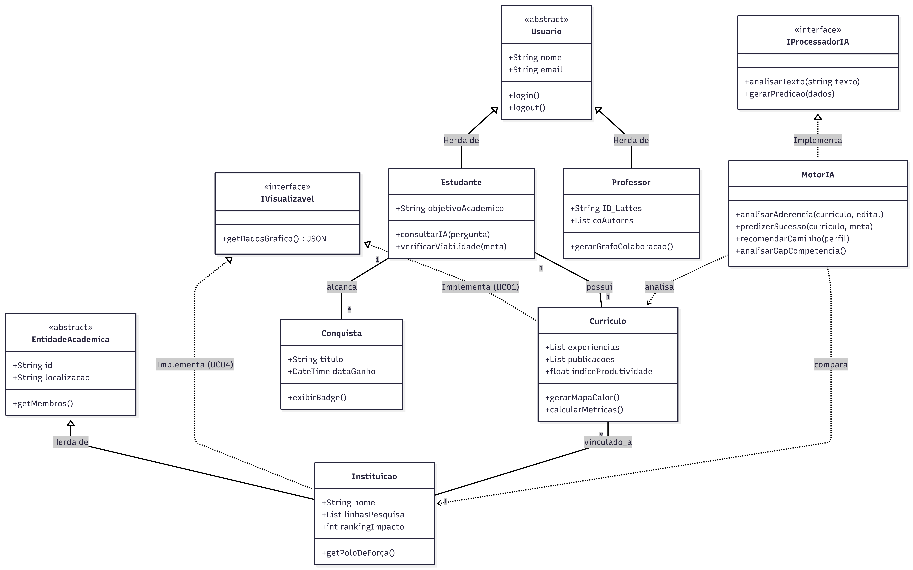

# 👓 Academix AI

O Academix AI é uma plataforma de analytics de alto nível voltada para o ecossistema acadêmico. Utilizando Inteligência Artificial Generativa e Preditiva, o sistema processa currículos e dados institucionais para oferecer insights estratégicos. Ele permite que nichos específicos apresentem suas trajetórias com base em dados reais de currículos acadêmicos e trajetórias acadêmicas.

Ele analisa padrões em milhares de trajetórias acadêmicas para responder perguntas complexas:

"Qual universidade possui o maior índice de publicação em Visão Computacional nos últimos 2 anos?" 🗣️🔥

"Com base no meu perfil atual, qual a probabilidade de aprovação em um mestrado na instituição X?" ❓❓ (To conjecturando...) 

## ✨ Funcionalidades (Casos de Uso)

UC01 – *Dashboard de Métricas Visuais*: Conversão de currículos textuais em gráficos de radar de competências e mapas de calor de produtividade. 📊

UC02 – *Motor de Busca por "Polos de Força"*: Busca inteligente que identifica quais faculdades ou linhas de pesquisa são líderes reais em temas específicos (ex: Visão Computacional, Segurança da Informação). 🚀

UC03 – *Preditor de Trajetória (IA)*: A IA analisa o currículo do aluno e sugere o "próximo melhor passo" com base em perfis de sucesso similares. (Aqui achei uma boa ideia, mas tem que ver...) 🔥

UC04 – *Comparador de Ecossistemas*: Funcionalidade que coloca duas instituições lado a lado, comparando a produção científica real (por exemplo). ⚖️

UC05 – *Análise de Gap de Competência*: Identificação automática do que falta no currículo do aluno para atingir um objetivo específico (ex: uma vaga de intercâmbio). (Aqui também só coloquei o que pensei, temos que discutir...)

UC06 - *Roadmap Dinâmico*: Uma linha do tempo gerada automaticamente que se ajusta conforme adicionada a conclusão de novas etapas acadêmicas. 🛣️

UC07 - *Rede de colaboração de pesquisa*: O sistema gera um grafo de visualização para a rede de contatos dos professores entre co-autores, frequência de publicações e alunos.

UC08 - *Timeline de produções*: Em que anos o professor publicou mais e em quais temas. ⏱️

UC09 - *Relação de defesas*: Em quais bancas o professor já participou e métricas de quais professores estiveram presentes.

## Diagrama de Classes (UML) 

Bom salientar que organizei a relação de dependência da forma que achei conveniente. Assim, por óbvio, é possível alterar a depender dos problemas durante a implementação ou coisas dessa natureza.

Vou colocar uma descrição abaixo para facilitar o entendimento das relações de dependências por mim sugeridas:

1. **Herança (Generalização)**

    *Símbolo:* Uma linha sólida com uma ponta de seta em triângulo vazio (<|--).

    *Significado:* Indica que uma classe "é um tipo de" outra. A classe filha herda todos os atributos e métodos da classe pai.

    *Aplicação no projeto:* Usuario <|-- Estudante. Significa que o Estudante herda propriedades básicas de login e perfil, mas possui funções específicas para consulta de IA.

2. **Realização (Interface)**

    *Símbolo:* Uma linha tracejada com uma ponta de seta em triângulo vazio (<|..).

    *Significado:* Indica que uma classe implementa um contrato definido por uma interface.

    *Aplicação no projeto:* IProcessadorIA <|.. MotorIA. Garante que o Motor de IA realizará as funções de predição exigidas pelo sistema, independentemente de qual modelo (OpenAI ou outro) esteja por trás.

3. **Associação com Multiplicidade**

    Símbolo: Uma linha sólida simples (--).

    Significado: Indica uma relação estrutural persistente entre dois objetos.

    *Multiplicidade:*

     "1" -- "1": Relação exclusiva (ex: um Estudante possui um Currículo).

     "1" -- "*": Um objeto está ligado a vários outros (ex: um Estudante pode ter várias Conquistas no Roadmap).

4. **Dependência**

    *Símbolo:* Uma linha tracejada com uma ponta de seta aberta (..>).

    *Significado:* Indica uma relação mais fraca de "uso". Uma classe depende da outra para realizar uma operação momentânea, mas não a contém permanentemente.

    *Aplicação no projeto:* MotorIA ..> Curriculo. O Motor de IA precisa ler os dados do Currículo para gerar o insight, mas não "é dono" do currículo.

## 💻 Tecnologias Utilizadas

*Front-end*:

O projeto utiliza React.js e Tailwind CSS para uma interface moderna. A visualização de dados complexos, como os mapas de calor, é feita através da biblioteca D3.js.

*Back-end*:

A estrutura de serviços pode ser montada em Python (FastAPI) (Aqui preferencialmente, melhor para lidar com dados), ou C/C++ (que a gente domina mais). O processamento de inteligência artificial é realizado via LangChain com modelos da OpenAI (Aqui acho que ficaria muito trabalhoso treinar um modelo do zero, mas é possível).

*Dados*:

O armazenamento utiliza PostgreSQL (recomendo) com a extensão pgvector, permitindo que a IA realize buscas semânticas rápidas para encontrar perfis e instituições similares.

## Informações adicionais

Bancos de Dados a serem utilizados:

<http://bi.cnpq.br/painel/formacao-atuacao-lattes/>

## Autores/Disciplina

- Marcos Fontes
- Thiago Raquel
- Yuri Maximiliano

*Disciplina*: Engenharia de Software - 35M56
